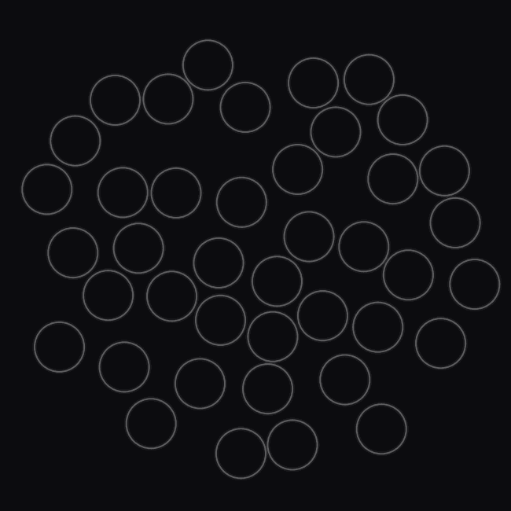

<h1 align="center">Tracing Disks</h1>

<p align="center">
  
</p>

A 2D ray tracer for computing scattering from many small disks (or a single large disk). Rays reflect/refract using Fresnel equations, accumulate energy, and produce an angular distribution. Includes a **plot mode** that records geometry + ray paths so we can generate an animation.

## ⚙️ Build
### Linux
```bash
g++ -O3 -std=c++17 -fopenmp tracedisks.cpp -o trace
```

## 🚀 Run

### 1) Single large disk
Produces a `.bin` distribution file.
```bash
./trace single
```

### 2) Many small disks (averaged over experiments)
```bash
./trace multiple
```

### 3) Plot mode (record one random configuration for visualization)
Writes `circles.csv` and `rays.json` for the Python animator.
```bash
./trace multiple --plot
```

### Common flags
| Flag | Description | Default |
|------|-------------|---------|
| `--num_paths` | Rays per experiment | `1000000` |
| `--num_circles` | Maximum number of small disks | `100` |
| `--radius_small` | Radius of each small disk | `1.0` |
| `--n1`, `--n2` | Refractive indices outside/inside | `1.00 / 1.50` |
| `--sigma_a` | Absorption coefficient | `0.0` |
| `--num_exp` | Experiments to average (multiple mode) | `100` |
| `--epsilon` | Minimum gap between disks when packing | `0.1` |
| `--max_bounces` | Max per-ray interactions | `100` |
| `--num_bins` | Angular histogram bins | `100` |
| `--plot` | Enable recording for visualization | — |


## 🎨 Visualize

Use `plot.ipynb` to convert `circles.csv` + `rays.json` into a video, or visualize the scattering distributions.

## 📂 Output files
- `single_sigma_*_n1_*_n2_*.bin`, `multiple_avg_sigma_*_n1_*_n2_*_radius_*.bin`: binary arrays of length `num_bins`, the angular energy distribution.
- `circles.csv`: center `(cx, cy)` and radius `r` for each disk (first row = big boundary radius at (0,0)).
- `rays.json`: one ray per line, e.g. `{ "points": [[x,y],...], "out_angle": ..., "energy": ... }`.

## 🧠 How it works
- Disks are packed randomly with a grid-accelerated rejection sampler (no overlaps).
- Rays start at the left; at each hit: compute normal, Fresnel reflectance; reflect or refract; attenuate via absorption.
- Outgoing rays’ angles and energies are binned into an angular histogram.
- In **plot mode**, a single configuration’s disks and a subset of rays are recorded for animation.
